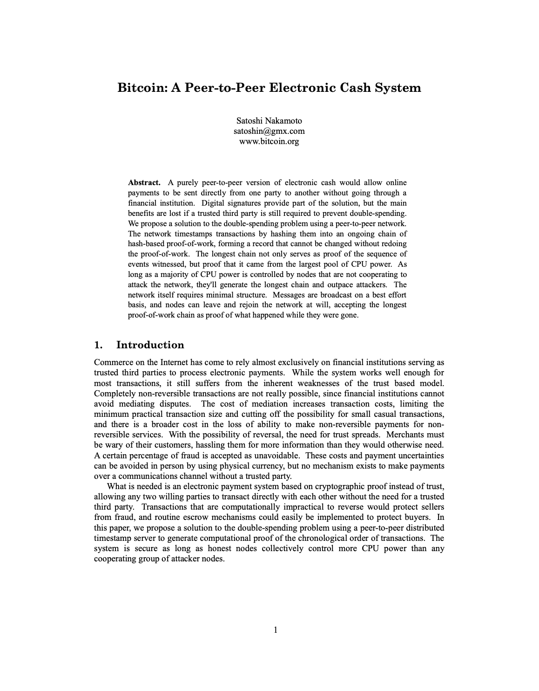

# pdf_reflow — single-column mobile reflow for PDFs

From  to  in one step.

Convert any text-heavy PDF (academic paper, manual, datasheet) into a
single-column PDF sized for a phone screen. Diagrams and equations are
rasterized from the original page and scaled to fit the new column width;
running headers/footers/page numbers are dropped; code blocks keep their
line breaks; section headings keep their hierarchy.

There's a [browser demo](web/) that runs the same pipeline client-side
via Pyodide + PyMuPDF-WASM — no upload, no server. See `web/README.md`
for how to serve it locally or deploy as a static site.

## Why Python

PDF is a 1,000-page spec with deeply entangled subsystems (content streams,
font/encoding tables, CMap/ToUnicode, color spaces, transparency groups…).
Writing a parser from scratch is impractical for a focused tool. Python has
the most pragmatic ecosystem here:

- **PyMuPDF** (a C wrapper around MuPDF) is the most performant and accurate
  Python PDF reader. It exposes everything we need: glyph-level positions,
  font names, drawing primitives, clip-rect rasterization, and base-14 font
  metrics — without us linking another shaper.
- The reflow algorithm itself — paragraph detection, column inference,
  figure-band extraction, reading order, line breaking, paginated output —
  is written from scratch here in pure Python. Only the lowest layer (parse
  PDF bytes, measure glyph widths, rasterize a page rect) calls into MuPDF.

Alternatives considered:

| Language | PDF lib              | Verdict |
|----------|----------------------|---------|
| Go       | `pdfcpu`, `ledongthuc/pdf` | Limited content-stream extraction; lacks accurate glyph positions and image rasterization. |
| Rust     | `lopdf`, `pdf-rs`    | Low-level only; would need a custom text/glyph extractor. |
| Node     | `pdf.js`             | JS port of a desktop renderer; expensive cold-start; rasterization tied to canvas. |
| Java     | Apache PDFBox        | Mature, but JVM startup eats the budget for a CLI tool. |

Python + MuPDF gives the smallest amount of dependency for the largest
amount of correct parsing. Performance: full reflow of the 9-page Bitcoin
whitepaper is under 1.5 seconds (cold) on a modern Linux box.

## Algorithm overview

The pipeline is five stages, mirroring how Adobe's Liquid Mode is
described in their patents (block detection → reading order → AI-assisted
semantic tagging → re-paginate). We don't use any ML; the heuristics below
hold up well for technical PDFs.

1. **Extract** (`extract.py`)
   PyMuPDF returns text in `rawdict` form. We iterate every glyph, taking
   its exact bbox, font, size, flags, and color. Vector drawing primitives
   (lines, rectangles, paths) are reduced to bounding boxes. Embedded
   raster images get an entry too.

2. **Lines & blocks** (`analyze.py`)
   - **Lines:** group spans whose vertical midpoints differ by less than
     half a span height. Sort horizontally.
   - **Blocks:** group adjacent lines that have similar font sizes and
     vertical gaps below ~1.2 × line height.
   - **Body size:** weighted mode of all span sizes; defines what counts
     as "body text" for the rest of the pipeline.

3. **Classification** (`analyze.py`)
   Each block is tagged as one of:
   - `heading` — size > body + 1pt and bold, or much bigger than body
   - `body` — body-sized prose
   - `caption` — sub-body size text near a figure region
   - `code` — block in a Courier-family font (preserves line breaks)
   - `equation` — block containing characters in the Unicode Private Use
     Area (these are math symbols injected by LaTeX/PDF math fonts that
     never round-trip to plain text); routed to be rasterized
   - `label` — single-token numeric blocks (page numbers, axis ticks)

4. **Figure regions & reading order** (`analyze.py`)
   - Vector drawings on a page are merged vertically into figure
     **bands**. Equation blocks seed bands too. Captions and short
     fragments inside the band get absorbed.
   - Two-column pages are detected by clustering body-block x-centers.
   - Reading order is column-major top-to-bottom; figures take a synthetic
     slot at their band's top y.
   - Page-edge tiny text (likely a running header/footer) is dropped.

5. **Layout & render** (`layout.py`, `render.py`)
   - The target page is sized for a phone (default: 360 × 600 pt, similar
     to iPhone 17 logical bounds at PDF scale).
   - Text is wrapped using PyMuPDF's base-14 font metrics (`tiro`,
     `tibo`, `tiit`, `cour`). Break opportunities come from a pure-Python
     implementation of the Unicode line breaking algorithm (UAX #14 —
     the rule set ICU implements: break after spaces/hyphens, between
     ideographs, around slashes and em-dashes, never orphaning closing
     punctuation or splitting a number); the break points themselves are
     chosen by the Knuth-Plass total-fit algorithm (`linebreak.py`,
     `knuth_plass.py`) so the right margin is balanced instead of greedily
     ragged.
   - Figures are clipped from the original page (tightened horizontally to
     the actual content bbox in the band) and rasterized at 220 dpi,
     scaled to fit the column width.
   - Small code blocks are kept together on one page; large code blocks
     are scaled down so the longest line fits the column.

## How this compares to Adobe's Liquid Mode

Adobe's Liquid Mode (Acrobat Reader, since 2020) uses their Sensei ML
service to:
- segment the page into semantic regions (heading/body/figure/list/etc),
- learn the reading order across columns and reflowed insets,
- transform the rendered tree to HTML/CSS for re-rendering at any width.

We implement the same shape — semantic segmentation, reading order,
re-render — with **no ML and no third-party layout engine**, just
geometry + font heuristics. The trade-off is that ML can do well on
visually unusual PDFs (multi-tier sidebars, decorative layouts) where
the heuristics here are bound to fail.

## Setup (macOS with `uv`)

[`uv`](https://docs.astral.sh/uv/) handles the Python toolchain, the
virtualenv, dependency resolution, and lockfile in one binary.

```bash
# 1. Install uv (one-time)
brew install uv
# or:  curl -LsSf https://astral.sh/uv/install.sh | sh

# 2. Clone and enter the project
git clone https://github.com/josherich/readings.git
cd readings/pdf_reflow

# 3. Create the venv and install pinned deps from uv.lock
uv sync
```

`uv sync` reads `pyproject.toml` + `uv.lock`, downloads CPython if needed,
creates `.venv/`, installs PyMuPDF, and editable-installs the `pdf_reflow`
package. About 5 seconds on a fresh machine.

If you ever want a clean reset:

```bash
rm -rf .venv && uv sync
```

## Run the CLI (macOS)

`uv run` resolves the command against the project's venv without you needing
to activate it.

```bash
# Reflow the included Bitcoin whitepaper fixture (default = iPhone 17 preset)
uv run pdf-reflow tests/fixtures/bitcoin.pdf ~/Desktop/bitcoin-mobile.pdf

# Try other device presets
uv run pdf-reflow input.pdf output.pdf --preset iphone-mini
uv run pdf-reflow input.pdf output.pdf --preset ipad-mini
uv run pdf-reflow input.pdf output.pdf --preset kindle

# Custom page dimensions / body font size / figure DPI
uv run pdf-reflow input.pdf output.pdf \
    --page-width 320 --page-height 568 \
    --body-size 12 --figure-dpi 300

# Parallelize page extraction + figure rasterization across worker processes
# (use this for long technical reports; small papers won't benefit). 0 = auto.
uv run pdf-reflow long_report.pdf out.pdf --workers 4

# Open the result in macOS Preview
open ~/Desktop/bitcoin-mobile.pdf
```

You can also invoke it as a module:

```bash
uv run python -m pdf_reflow input.pdf output.pdf
```

Or activate the venv if you prefer the classic flow:

```bash
source .venv/bin/activate
pdf-reflow input.pdf output.pdf
deactivate
```

## Run the tests (macOS)

```bash
# All 12 correctness + performance tests
uv run python -m unittest discover -v

# Or a specific test
uv run python -m unittest tests.test_reflow.ReflowCorrectnessTests.test_pages_are_single_column

# With timing
time uv run python -m unittest discover
```

Expected: `Ran 12 tests in ~1.4s ... OK`.

The fixture `tests/fixtures/bitcoin.pdf` is the official Bitcoin whitepaper
(184 KB, 9 pages — sourced from
`github.com/house-of-bitcoin/whitepaper@HEAD`; bytes match the canonical
copy hosted on `bitcoin.org`).

The suite asserts behavior (every section heading is preserved, C code
stays as code, every page is a single column, every figure is rasterized,
no private-use glyph garbage leaks into text, reading order is monotonic)
and performance (full reflow under 5 seconds; extract and analyze phases
under 1 second each on a 9-page paper).

## Verify harness (iterate on rendering quality)

The unittest suite pins specific bugs; the **verify harness** measures overall
reflow quality across the whole fixture corpus and gates regressions. It needs
no extra dependencies (stdlib + PyMuPDF) and runs in the same venv.

```bash
# Score every fixture and gate against the committed baseline (CI-friendly).
uv run python tools/verify.py

# Add a browsable HTML scorecard report and open it.
uv run python tools/verify.py --report --open

# Re-bless the numeric baseline after an intentional change.
uv run python tools/verify.py --update-baseline
```

It reflows each fixture and, using the *source's own reading-order text as
ground truth* (reflow must preserve text + order, only geometry changes),
reports word retention, dropped/spurious/garbled words, heading survival,
lines clipped by the page edge, and private-use-glyph leakage — failing CI
when a gating metric regresses vs `verify/baseline.json`. The HTML report is a
per-fixture scorecard with the baseline delta and any dropped headings, for
the run → read → adjust → rerun loop. See [`docs/verify.md`](docs/verify.md)
for the design and how to grow the corpus.

## Library usage

```python
from pdf_reflow import reflow_pdf, ReflowConfig

stats = reflow_pdf(
    "paper.pdf",
    "paper-mobile.pdf",
    ReflowConfig(page_width=360, page_height=640),
)
print(stats)
# -> {'source_pages': 9, 'output_pages': 11, 'items': 57, ...}
```

## Performance & parallelism

The pipeline has two pure-Python phases (analyze, layout) and two
PyMuPDF-bound phases (extract, render). On a 30-page technical report
extract alone is 18+ seconds because `get_text("rawdict")` and
`get_drawings` each chew through every glyph and every vector primitive
on the page. Layout was the surprise hotspot on smaller papers — every
greedy word-wrap step was a SWIG round-trip into MuPDF's
`Font.text_length`.

What changed:

- **Per-character width cache in `layout.FontMetrics`.** Pre-computes a
  glyph-advance table at unit font size for each base-14 font, so
  measuring a paragraph becomes a Python-side sum. Layout dropped from
  0.22 s → 0.01 s on the Bitcoin paper (≈22× faster on its own).
- **Process-parallel page extraction** (`extract_document_parallel`)
  and **process-parallel figure rasterization** (`render._prerasterize_figures`).
  Each worker opens its own `fitz.Document` because PyMuPDF is not
  thread-safe at the Document level — the SWIG calls into MuPDF also
  hold the GIL, so threading wouldn't help even if it were safe. Small
  documents stay on the sequential path because process-pool startup
  costs ~50–150 ms on Linux.

Measured on a 4-core laptop after these changes:

| Fixture                | Pages | Before | After (1 worker) | After (4 workers) |
|------------------------|-------|--------|------------------|-------------------|
| `bitcoin.pdf`          | 9     | 0.81 s | 0.37 s           | 0.35 s            |
| `mit_latex_sample.pdf` | 4     | 0.32 s | 0.16 s           | 0.20 s (overhead) |
| `tech_report.pdf`      | 30    | 24.7 s | 15.6 s           | 6.3 s             |

The tech-report case is the one the parallel path is built for: extract
goes from 18.9 s → ~3.6 s with 4 workers (5×). For 4-page papers the
process-pool startup dominates so the default is `workers=1`; pass
`--workers 0` to opt into auto-detection.

### Why processes, not threads?

PyMuPDF's `Document` and `Page` objects are bound to a per-Document
MuPDF context. Sharing one across threads is undefined behaviour; the
SWIG wrapper additionally keeps the GIL held during `get_drawings`,
`get_text("rawdict")`, and `get_pixmap`, so even safe-by-construction
threading wouldn't deliver parallelism for the extract phase. The
project therefore uses `concurrent.futures.ProcessPoolExecutor` with
each worker calling `fitz.open(src_path)`. The data crossing the
process boundary is the per-page `PageContent` dataclass (plain
spans/drawings/images, fully pickleable) plus PNG bytes for figures.

If you'd rather use threads — e.g. integrating into an existing thread
pool — you can: open a brand-new `fitz.Document` inside each thread
(not a shared one), and call `extract_page` against it. Expect modest
speed-ups because of the GIL.

### Benchmark suite

`tests/test_benchmark.py` measures per-phase and end-to-end wall-clock
time on the three fixtures and asserts (a) generous end-to-end budgets,
(b) per-phase budgets, and (c) that `workers=N` is genuinely faster
than `workers=1` on the 30-page report.

```bash
# Run as part of the unittest suite
uv run python -m unittest tests.test_benchmark -v

# Or print a timing report
uv run python -m tests.test_benchmark --report
```
